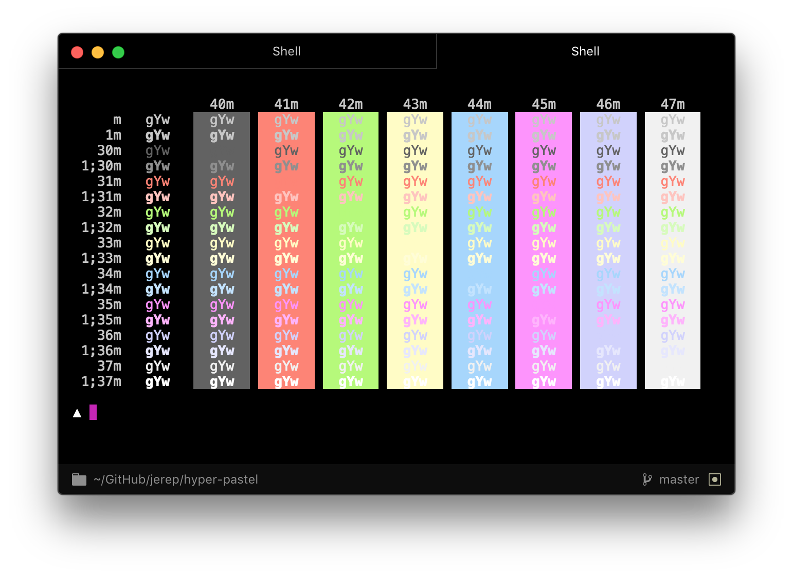

# Pastel theme for Hyper

Pastel colors ported from [iTerm's](https://www.iterm2.com/) color presets to [Hyper](https://hyper.is).



## Install

Add `hyper-pastel` to the plugins list in your `~/.hyper.js` config file.

```js
plugins: [
  'hyper-pastel'
]
```

## License

MIT
